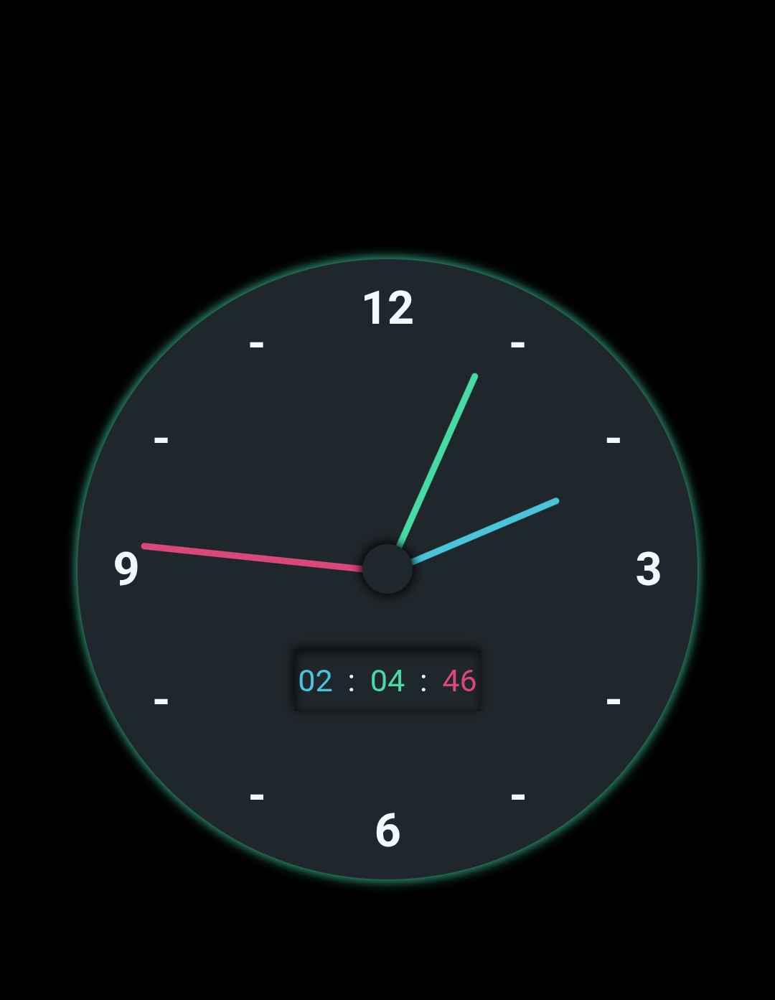

# ⏰ Analog-Digital Clock

A simple clock application built with **HTML**, **CSS**, and **JavaScript** that displays the current time in both analog and digital formats. This project demonstrates the use of JavaScript for real-time updates, along with CSS for styling and HTML for structure.

## Features ✨

- **Real-Time Update**: The clock updates every second ⏱️ to reflect the current time.
- **Analog Display**: An elegant analog clock design that mimics a classic wall clock 🕰️.
- **Digital Display**: A clear digital representation of the time 💻.
- **Responsive Design**: The clock displays well on various screen sizes 📱.

## Live Demo 🌐

You can view the live demo of the clock [here](your-live-demo-link).

## Screenshot 📸



## Installation ⚙️

To get a local copy up and running, follow these steps:

1. Clone the repository:
   ```bash
   git clone https://github.com/anmoljaisinghani/Frontend-Mini-Projects.git
   ```

2. Navigate to the project folder:
   ```bash
   cd Frontend-Mini-Projects/1. analog clock
   ```

3. Open the `index.html` file in your web browser 🌍.

## Usage 🖥️

Simply open the `index.html` file in your browser, and you will see both the analog and digital clocks displaying the current time. The clock will continue to update in real-time ⏳.

## Tech Stack 🛠️

- **HTML**: For the structure of the clock.
- **CSS**: For styling and layout.
- **JavaScript**: For implementing the clock functionality and real-time updates.

## Contributing 🤝

Contributions are welcome! If you'd like to improve this project, please fork the repo and submit a pull request 🚀.

1. Fork the repository
2. Create your feature branch: `git checkout -b feature/YourFeature`
3. Commit your changes: `git commit -m 'Add some feature'`
4. Push to the branch: `git push origin feature/YourFeature`
5. Open a pull request

## License 📜

This project is licensed under the MIT License - see the [LICENSE](LICENSE) file for details.

## Acknowledgements 🙌

- Inspired by various online clock tutorials.
- Uses modern CSS for styling and animations.

## Contact 📧

For questions or feedback, feel free to reach out to me at [My Email](anmoljaisinghani7@gmail.com)

Happy Clocking! 🎉